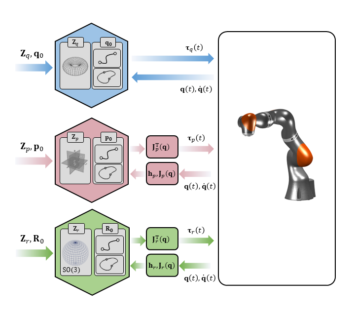

## My name is Moses
I am originally from South Korea. My Korean name is 나종욱 (羅鍾煜).

Currently, I am a postdoctoral research scientist at [Honda Research Institute (HRI)](https://usa.honda-ri.com/). I am developing robot control algorithms to improve robustness (and success rates) for dexterous and contact-rich manipulation tasks.

Prior to HRI, I earned my PhD at [Massachusetts Institute of Technology (MIT)](https://www.mit.edu/). I was honored to have [Prof. Neville Hogan](https://scholar.google.com/citations?user=P7S5TY0AAAAJ&hl=en) as my advisor, the inventor of [Impedance Control](https://www.academia.edu/download/59138147/hogan1985_theory20190506-105695-l1rk3b.pdf). I was also privileged to work closely with [Prof. Jean-Jacques Slotine](https://scholar.google.com/citations?user=TcREpMQAAAAJ&hl=en). During my graduate studies, I was fortunate to have [Dr. Johannes Lachner](https://jlachner.github.io/) as a mentor, who introduced me to the world of Differential Geometry. With Dr. Lachner, I co-developed [Explicit](https://github.com/explicit-robotics), which derives kinematic and dynamic parameters of the robot based on the Theory of Lie Groups and Lie Algebra.

My research on [modular robot control](https://arxiv.org/abs/2505.10694) and [dynamic manipulation of deformable objects](https://pubmed.ncbi.nlm.nih.gov/37554449/) was recognized with Best Paper Awards at [IROS 2024](https://www.youtube.com/live/LJYOVsKJMsI?si=NOOi1_E7VlncNLAf&t=12442) and [BIOROB 2020](https://coe.northeastern.edu/news/best-student-paper-at-8th-ieee-biomedical-robotics-and-biomechatronics-conference/). Check out the robotic demonstrations below.

I graduated Summa Cum Laude from [Seoul National University (SNU)](https://en.snu.ac.kr/index.html). I am also an alumnus of [Gyeonggibuk Science High School](https://gbs-h.goeujb.kr/). I was a Gold Medalist in the Korean Physics Olympiad (KPhO) and was selected for the Summer and Winter candidate schools for the International Physics Olympiad (IPhO).

## Devoting my life to Robotics
In my early twenties, I decided to devote my career to robotics, deeply influenced by the works of [**Norbert Wiener**](https://en.wikipedia.org/wiki/Norbert_Wiener)—specifically [**Cybernetics**](https://en.wikipedia.org/wiki/Cybernetics:_Or_Control_and_Communication_in_the_Animal_and_the_Machine) and [**The Human Use of Human Beings**](https://en.wikipedia.org/wiki/The_Human_Use_of_Human_Beings). 
The [Cybernetics](https://en.wikipedia.org/wiki/Cybernetics) movement is where the field of robotics was born.
The way Cybernetics bridged neuroscience, biology, information theory, and control theory to explain the complex mechanisms of living organisms deeply inspired me. That inspiration drove me to craft my [**Statement of Purpose**](CV/SOP_MIT_MECHE.pdf), and I was fortunate to be accepted to MIT—the very place where Wiener once taught in the Department of Mathematics

## Research - Key Videos (ALL REAL TIME!)
I'm here for real-time robot control. **All videos are 1x. No fast-forward tricks since I'm impatient :)**

For my Master's Thesis, I studied dynamic manipulation of flexible, deformable objects. 
I discovered that using *primitives* serves as an effective *inductive bias* to dramatically simplify dynamic control of complex objects. 
A list of selected publications are:
- [*Dynamic primitives facilitate manipulating a whip*, 2020 BIOROB, **Best Student Paper Award**](https://ieeexplore.ieee.org/abstract/document/9224399/)
- [*Learning to manipulate a whip with simple primitive actions–A simulation study*, 2023 iScience](https://www.cell.com/iscience/fulltext/S2589-0042(23)01472-4)

<table style="border:0px; width:100%;">
  <tr style="border:0px;">
    <td align="center" style="border:0px; width:70%;">
       
    </td>
    <td align="center" style="border:0px; width:30%;">
       <video src="https://github.com/user-attachments/assets/ca6eb637-a450-4c07-9965-d15418ec45c8" width="100%" autoplay loop muted playsinline></video>
    </td>
  </tr>
</table>

For my Doctoral Thesis, I merged Impedance Control with Dynamic Movement Primitives (DMP) and extend it to a definition of modules, thereby completing modular robot control.
Both impedance and movements are primitives which we refer to as *Elementary Dynamic Actions (EDA).* 

  

Check out my [Github repository](https://github.com/MosesAndLily/DMP_vs_EDA) to try out the codes.
A list of selected publications are:
- [*On the Modularity of Elementary Dynamic Actions*, 2024 IROS, **Best Conference Paper Award**](https://ieeexplore.ieee.org/abstract/document/10801502)
- [*Modular Robot Control with Motor Primitives*, 2025 ArXiv](https://arxiv.org/abs/2505.10694)
- [*Combining Movement Primitives with Contraction Theory*, 2025 ArXiv](https://arxiv.org/abs/2501.09198)

### [Example 1] Modular Imitation Learning and Motion Planning

  <video src="https://github.com/user-attachments/assets/9a536635-940f-4d1f-826c-b91faa61a96c" width="100%" autoplay loop muted playsinline></video>

### [Example 2] Exploiting Kinematic Singularity

  <video src="https://github.com/user-attachments/assets/476458d2-0554-4f66-a36a-00e256334e22" width="100%" autoplay loop muted playsinline></video>

### [Example 3] Object-centric Compliance Control and Polishing Task

  <video src="https://github.com/user-attachments/assets/14033f0d-f204-4d88-9ff3-ce9345ea7371" width="100%" autoplay loop muted playsinline></video>

