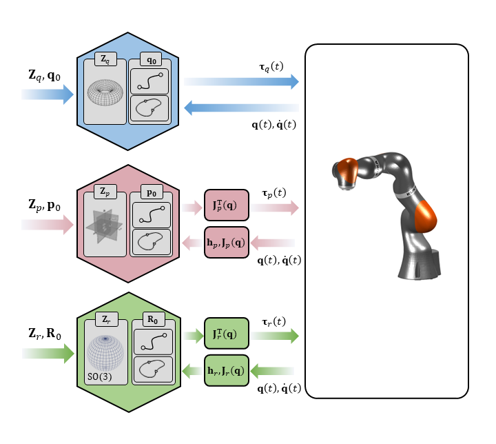
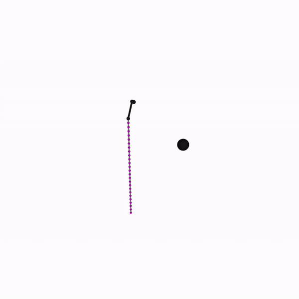

<picture>
  <source media="(prefers-color-scheme: dark)" srcset="assets/banner-dark.svg">
  
</picture>

  <a href="https://mosesandlily.github.io/"><picture><source media="(prefers-color-scheme: dark)" srcset="assets/btn-website-dark.svg"></picture></a>
  <a href="https://scholar.google.com/citations?user=PiFv1uUAAAAJ"><picture><source media="(prefers-color-scheme: dark)" srcset="assets/btn-scholar-dark.svg"></picture></a>
  <a href="https://orcid.org/0000-0002-9658-9678"><picture><source media="(prefers-color-scheme: dark)" srcset="assets/btn-orcid-dark.svg"></picture></a>
  <a href="https://www.linkedin.com/in/moses-c-nah-40b4a7215/"><picture><source media="(prefers-color-scheme: dark)" srcset="assets/btn-linkedin-dark.svg"></picture></a>
  <a href="mailto:moses890@gmail.com"><picture><source media="(prefers-color-scheme: dark)" srcset="assets/btn-email-dark.svg"></picture></a>
  <a href="CV/cv_MN_20260104.pdf"><picture><source media="(prefers-color-scheme: dark)" srcset="assets/btn-cv-dark.svg"></picture></a>

I am the first member of **Holiday Robotics Research Inc.**, the US division of [Holiday Robotics](https://holiday-robotics.com/), South Korea's fastest-growing robotics company. I build robot controllers for physical interaction: impedance control, contact-rich manipulation, and motor primitives, running in real time on real hardware.

I earned my Ph.D. in Mechanical Engineering at [MIT](https://www.mit.edu/), where I was honored to have [Prof. Neville Hogan](https://scholar.google.com/citations?user=P7S5TY0AAAAJ&hl=en), the inventor of [impedance control](https://doi.org/10.1115/1.3140702), as my advisor, and privileged to work closely with [Prof. Jean-Jacques Slotine](https://scholar.google.com/citations?user=TcREpMQAAAAJ&hl=en). [Dr. Johannes Lachner](https://scholar.google.com/citations?user=i5KAhh4AAAAJ&hl=en) mentored me through graduate school and introduced me to differential geometry. Together we created [Explicit](https://github.com/explicit-robotics), an open-source library that derives a robot's kinematics and dynamics from Lie groups and Lie algebras.

Before MIT, I graduated *summa cum laude* from [Seoul National University](https://en.snu.ac.kr/index.html), after [Gyeonggibuk Science High School](https://gbs-h.goeujb.kr/). I was a Gold Medalist at the Korean Physics Olympiad and was selected for the Summer and Winter candidate schools of the International Physics Olympiad. I am originally from South Korea, and my Korean name is 나종욱 (羅鍾煜).

My research on [modular robot control](https://arxiv.org/abs/2505.10694) and [dynamic manipulation of deformable objects](https://doi.org/10.1016/j.isci.2023.107395) received Best Paper Awards at [IROS 2024](https://www.youtube.com/live/LJYOVsKJMsI?si=NOOi1_E7VlncNLAf&t=12442) and [BIOROB 2020](https://coe.northeastern.edu/news/best-student-paper-at-8th-ieee-biomedical-robotics-and-biomechatronics-conference/). At MIT I also served as a teaching assistant for dynamics and for linear and nonlinear control; [my recitation notes are on my website](https://mosesandlily.github.io/notes_index.html). Here are my [CV](CV/cv_MN_20260104.pdf) and [résumé](CV/resume_MN_20260104.pdf).

## Research

> [!NOTE]
> Every video on this page plays at **1× speed**. No fast-forward tricks: I am here for real-time robot control, and I am impatient. :)

### Modular robot control with motor primitives

Ph.D. thesis · MIT · 2020 – 2024

A robot should not need a new controller for every task. My doctoral work merged impedance control with Dynamic Movement Primitives and extended both into a formal definition of *modules*, so that a finite set of control modules composes an infinite range of behaviors. Both impedance and movement are primitives, which we call *Elementary Dynamic Actions* (EDA).

  

**Selected publications**

- [On the Modularity of Elementary Dynamic Actions](https://doi.org/10.1109/iros58592.2024.10801502) · IROS 2024 · **Best Conference Paper Award**
- [Modular Robot Control with Motor Primitives](https://arxiv.org/abs/2505.10694) · arXiv 2025
- [Combining Movement Primitives with Contraction Theory](https://arxiv.org/abs/2501.09198) · arXiv 2025
- [Robot Control Based on Motor Primitives: A Comparison of Two Approaches](https://doi.org/10.1177/02783649241258782) · IJRR 2024

**Code** · [ModularRobotControl](https://github.com/MosesAndLily/ModularRobotControl) · [DMP_vs_EDA](https://github.com/MosesAndLily/DMP_vs_EDA) · [DMP-comparison](https://github.com/MosesAndLily/DMP-comparison)

#### Modular imitation learning and motion planning

Modules for handling kinematic singularity and redundancy, movements learned from demonstration, and orientation primitives are composed on the fly to shake and pour a cocktail.

<video src="https://github.com/user-attachments/assets/9a536635-940f-4d1f-826c-b91faa61a96c"></video>

#### Exploiting kinematic singularity

<table>
  <tr>
    <td width="36%" valign="middle">
      Kinematic singularities are usually avoided at all costs. The controller here never inverts a Jacobian, so the arm moves straight through singular configurations, where the smallest singular value of the task-space inertia vanishes, and can even put them to use.
    </td>
    <td width="64%" valign="top">
      <video src="https://github.com/user-attachments/assets/476458d2-0554-4f66-a36a-00e256334e22"></video>
    </td>
  </tr>
</table>

#### Object-centric compliance control and polishing

Compliance is defined about a point on the grasped object rather than at the robot's flange. The same modules polish the surface no matter how the tool is held.

<video src="https://github.com/user-attachments/assets/14033f0d-f204-4d88-9ff3-ce9345ea7371"></video>

### Dynamic manipulation of deformable objects

M.S. thesis · MIT · 2018 – 2020

How do humans manage the dynamics of a whip, an object with practically infinite degrees of freedom, using a neuromuscular system a million times slower than a robot's? I found that *dynamic primitives* act as an inductive bias that dramatically simplifies the problem. In simulation, a whip with 54 degrees of freedom reached distant targets with a single movement described by five parameters, and no model of the whip at all.

<table>
  <tr>
    <td width="42%" valign="top" align="center">
      
    </td>
    <td width="58%" valign="top" align="center">
      <video src="https://github.com/user-attachments/assets/ca6eb637-a450-4c07-9965-d15418ec45c8"></video>
    </td>
  </tr>
  <tr>
    <td align="center">Simulation: a 54-DOF whip reaching a target with one primitive movement.</td>
    <td align="center">Hardware: Baxter tossing a cloth onto a rack.</td>
  </tr>
</table>

**Selected publications**

- [Dynamic Primitives Facilitate Manipulating a Whip](https://doi.org/10.1109/biorob49111.2020.9224399) · BIOROB 2020 · **Best Student Paper Award**
- [Manipulating a Whip in 3D via Dynamic Primitives](https://doi.org/10.1109/iros51168.2021.9636257) · IROS 2021
- [Learning to Manipulate a Whip with Simple Primitive Actions: A Simulation Study](https://doi.org/10.1016/j.isci.2023.107395) · iScience 2023
- [Motor Control Beyond Reach: How Humans Hit a Target with a Whip](https://doi.org/10.1098/rsos.220581) · Royal Society Open Science 2022

**Code** · [whip-project-targeting](https://github.com/MosesAndLily/whip-project-targeting)

## Software

| Project | What it is |
| --- | --- |
| [Explicit-MATLAB](https://github.com/explicit-robotics/Explicit-MATLAB) · [Explicit-cpp](https://github.com/explicit-robotics/Explicit-cpp) · [Explicit-FRI](https://github.com/explicit-robotics/Explicit-FRI) | Robot modeling from exponential maps and Lie groups: a MATLAB simulator, a C++ library, and its integration with KUKA's Fast Robot Interface. Co-developed with Dr. Johannes Lachner. |
| [ModularRobotControl](https://github.com/MosesAndLily/ModularRobotControl) | Code and data behind *Modular Robot Control with Motor Primitives*, in C++. |
| [DMP_vs_EDA](https://github.com/MosesAndLily/DMP_vs_EDA) | A one-to-one comparison of Dynamic Movement Primitives and Elementary Dynamic Actions, in Python. |
| [DMP-MATLAB](https://github.com/MosesAndLily/DMP-MATLAB) | Dynamic Movement Primitives in MATLAB. |
| [whip-project-targeting](https://github.com/MosesAndLily/whip-project-targeting) | Manipulating a whip with dynamic primitives, in Python and MuJoCo. |
| [ContractionTheoryExamples](https://github.com/MosesAndLily/ContractionTheoryExamples) | Worked examples of contraction theory. |

## Why robotics?

In my early twenties I decided to devote my career to robotics, deeply influenced by two books by [Norbert Wiener](https://en.wikipedia.org/wiki/Norbert_Wiener): [*Cybernetics*](https://en.wikipedia.org/wiki/Cybernetics:_Or_Control_and_Communication_in_the_Animal_and_the_Machine) and [*The Human Use of Human Beings*](https://en.wikipedia.org/wiki/The_Human_Use_of_Human_Beings). The [cybernetics](https://en.wikipedia.org/wiki/Cybernetics) movement is where the field of robotics was born, and the way it bridged neuroscience, biology, information theory, and control theory to explain living organisms inspired me deeply. That inspiration drove me to write my [Statement of Purpose](CV/SOP_MIT_MECHE.pdf), and I was fortunate to be accepted to MIT, the very place where Wiener once taught in the Department of Mathematics.

Moses C. Nah · <a href="https://mosesandlily.github.io/">mosesandlily.github.io</a>

